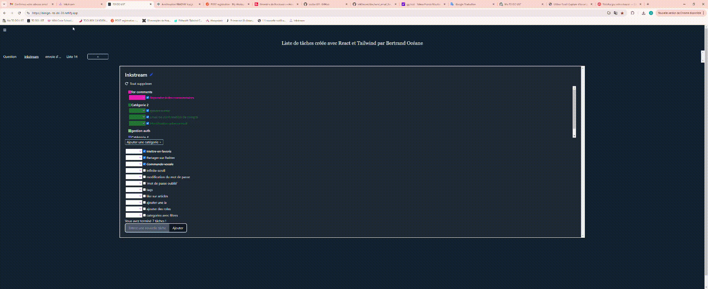

# TO DO LIST REACT

## Description

This To-Do List application is a simple and efficient tool designed to help users manage their tasks. Built with React, it offers a user-friendly interface that allows users to add, edit, delete, and mark tasks as complete. The application aims to improve productivity by providing a clear and organized way to keep track of daily.

## Access the Application

You can access the deployed application by visiting: [https://design--to-do-31.netlify.app/](https://design--to-do-31.netlify.app/)

- **Demo**  
  

## Features
- Add Tasks
- Edit Tasks
- Delete Tasks
- Mark as Complete
- Drag and Drop
- Tabs
- Categories
- Translation Mode
- Dark and Light Mode
- Responsive Design

## Build
Frontend: React
Style: Tailwind

## Installation
Clone the repository:
git clone repository_name

Install dependencies:
npm install

Start the application:
npm start

